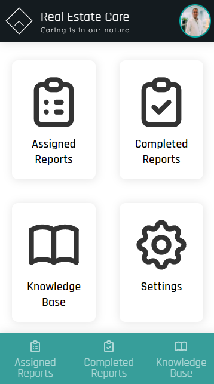

# Real Estate Care App

Voor het vak frameworks van de opleiding Frontend Developer van de LOI heb ik op basis van een cases een mobiele webapplicatie (demo model) moeten maken voor het fictieve bedrijf RealEstateCare. Deze organisatie onderhoudt, verbetert en inspecteert woningen voor allerlei opdrachtgevers zoals woningcorporaties en vastgoedontwikkelaars. De wens van deze organisatie is om inspectierapporten te digitaliseren en te integreren binnen de bestaande workflow.

Het demo model wat ik in React gebouwd heb is een progressive web app (PWA). In combinatie met Firebase Firestore wordt zowel de statische als dynamische data gecached en is de app ook offline volledig functioneel. Dit is ook de reden waarom ik voor Firebase heb gekozen in plaats van bijvoorbeeld My JSON server (hier werd op aangestuurd in de opdracht). In het demo model moest 2-staps-verificatie nagebootst worden met het gebruik van localStorage. Dit is iets wat ik in de praktijk anders zou doen i.v.m. veiligheid van sensitieve data.

Ik heb door dit project geleerd hoe ik een PWA kan maken, hoe Firebase Firestore werkt, hoe ik images in base64 formaat uit kan wisselen met een database en hoe real time data werkt in combinatie met Firebase. Ook heb ik veel geleerd over accessibility (WCAG 2.1) en hoe ik een meer gebruiksvriendelijke app kan bouwen. 

Ik liep er tegen aan dat queries naar Firebase Firestore een maximaal aantal KB’s mag zijn. Hierdoor is het mij onmogelijk gemaakt om in één query meerdere base64 images te sturen. Daardoor kan er in de app nu niet meer dan één foto toegevoegd worden. 

&nbsp;  

Bekijk de app via: https://realestatecare.netlify.app/#/

&nbsp;  

# Eindverantwoording

## Best practices & accessibility
Voor de komst van versie 16.8 van React op 6 februari 2019 waren de meeste components in React class based. Na die tijd zijn ze overgestapt naar functional components. De huidige docs van React zijn geschreven voor class based components en de beta versie van deze docs, die op functional components gebaseerd zijn, zijn voor zo’n 70% klaar. Omdat ik nu React met functional components leer is het lastig om up-to-date best practices en style guides te vinden omdat deze update nog zo recent is. Wel heb ik zo goed mogelijk de styles en best practices toe gepast die ik kon vinden, waaronder die gegeven door de LOI. Door middel van de WAVE Evaluation tool kon ik gemakkelijk (op WCAG-richtlijnen gebaseerde) accessibility errors opsporen en verhelpen. Daarnaast heb ik digitaaltoegankelijk.nl gebruikt als checklist bij de afronding van de app. Het enige wat, denk ik, nog ontbreekt is een goede manier om testprocedures (.pdf files etc.) te presenteren, die door gebruikers toegevoegd kunnen worden via installatie inspectierapportages, die aan alle richtlijnen voldoet.

## Security 
De app is gehost via Netlify. Netlify bied gratis HTTPS aan en wordt dus automatisch ook voor deze app gebruikt. Dit voorkomt potentiële XSS aanvallen in de applicatie in de uitwisseling van data tussen de app en Firebase. Daarnaast gebruik ik op geen enkele plek “DangerouslySetInnerHTML”, en als ik wel zoiets moet gebruiken lees ik alleen de tekst of waarde uit van een element. Wat wel een nadeel is van deze demo applicatie is dat de 2-staps-verificatie login afhankelijk is van de localStorage (zoals aangegeven in de opdracht). Als een aanvaller op een bepaalde manier kwaadwillende code weet te injecteren in deze applicatie dan kan deze gemakkelijk toegang krijgen tot de localStorage waar de gebruikersgegevens opgeslagen zijn. Daarnaast heb ik de inlog-code voor de 2-staps-verificatie ook toegevoegd aan het loginscherm voor deze demo om het bekijken en beoordelen van de app te vergemakkelijken. In de echte applicatie zou ik nooit localStorage gebruiken om gevoelige data op te slaan en ook geen code op het login scherm projecteren. Wel heb ik door middel van React Router pagina’s afgesloten voor gebruikers die niet ingelogd zijn. In dit project zijn ook een aantal packages gebruikt waarvan ik niet voor 100% de veiligheid kan garanderen. De testprocedures die aan de installatie inspectierapportages toegevoegd kunnen worden, worden door Sanitize URL NPM package gecheckt op kwaadwillende links/code.

## Usability
Voor de elementen in de app heb ik zo goed mogelijk duidelijke en bekende icons gebruikt. Dit zodat het ten alle tijden duidelijk is voor de gebruiker wat de knoppen doen. De icons hebben ook altijd dezelfde betekenis en zijn ook altijd op dezelfde plek terug te vinden. De gebruiker is vrij om te navigeren in de app, mocht een pagina niet bestaan/te vinden zijn dan wordt de gebruiker opgevangen in een error scherm. Mocht de gebruiker bepaalde acties ondernemen die negatieve gevolgen kunnen hebben dan wordt de gebruiker hierop geattendeerd. In de app zijn er meerdere wegen die naar Rome leiden. Via de homepage kan je op alle plekken in de app komen, je hebt ook een terug knop op alle schermen (behalve de homepage) waarmee je terug kunt navigeren naar de laatst bezochte pagina. Ook heb je een navigatie menu in de footer om naar de belangrijkste schermen te kunnen navigeren. Ten alle tijden kun je op het bedrijfslogo klikken om terug te navigeren naar het homescherm. Het enige wat nog ontbreekt in het demo model is een help/contact optie. 

